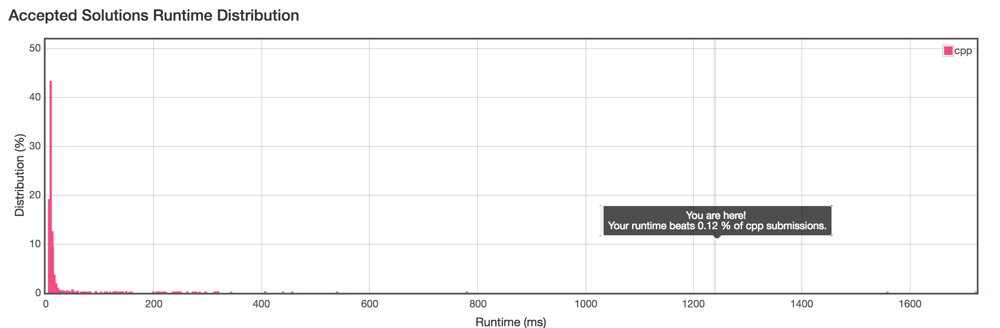

# 3Sum Closest

## Description

Given an array S of n integers, find three integers in S such that the sum is closest to a given number, target. Return the sum of the three integers. You may assume that each input would have exactly one solution.

## Example

```
For example, given array S = {-1 2 1 -4}, and target = 1.

The sum that is closest to the target is 2. (-1 + 2 + 1 = 2).
```

## Solution

* Recurse

```cpp
class Solution {
private:
    vector<int> arr;
    int recurse(vector<int>& nums, int size, int have_to_choose, int cursum, int target) {
        if (size < have_to_choose) {
            return 999999;
        }
        if (have_to_choose == 0) {
            return cursum;
        }
        if (size == have_to_choose) {
            int sum = 0;
            for (int i=0; i<size; i++) {
                sum += nums[i];
            }
            return sum+cursum;
        }

        int last_num = nums[size-1];
        int res_abort_last = recurse(nums, size-1, have_to_choose, cursum, target);
        int res_accept_last = recurse(nums, size-1, have_to_choose-1, cursum+last_num, target);
        if (abs(res_accept_last - target) < abs(res_abort_last - target)) {
            return res_accept_last;
        } else {
            return res_abort_last;
        }
    }
public:
    int threeSumClosest(vector<int>& nums, int target) {
        return recurse(nums, nums.size(), 3, 0, target);
    }
};
```

