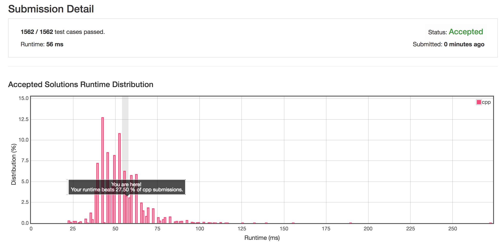

# [Add Two Number](https://leetcode.com/problems/add-two-numbers/description/)

## Description

You are given two non-empty linked lists representing two non-negative integers. The digits are stored in reverse order and each of their nodes contain a single digit. Add the two numbers and return it as a linked list.

You may assume the two numbers do not contain any leading zero, except the number 0 itself.

## Example

```
Input: (2 -> 4 -> 3) + (5 -> 6 -> 4)
Output: 7 -> 0 -> 8
Explanation: 342 + 465 = 807.
```

## Solution

```cpp
/**
 * Definition for singly-linked list.
 * struct ListNode {
 *     int val;
 *     ListNode *next;
 *     ListNode(int x) : val(x), next(NULL) {}
 * };
 */

class Solution {
public:
    ListNode* addTwoNumbers(ListNode* l1, ListNode* l2) {
        ListNode* head = new ListNode(0);
        ListNode* p1=l1;
        ListNode* p2=l2;
        ListNode* p = head;
        bool end = false;
        int n1,n2,n;
        
        while (!end) {
            end = true;
            
            if (p1) {
                end = false;
                n1 = p1->val;
                p1 = p1->next;
            } else {
                n1 = 0;
            }
            
            if (p2) {
                end = false;
                n2 = p2->val;
                p2 = p2->next;
            } else {
                n2 = 0;
            }
            
            n = n1 + n2 + p->val;
            if (n>=10) {
                p->val = n - 10;
                ListNode* pp = new ListNode(1);
                p->next = pp;
                p = p->next;
            } else {
                p->val = n;
                if (p1||p2) {
                    ListNode* pp = new ListNode(0);
                    p->next = pp;
                    p = p->next;
                }
            }
        } //end while
        
        return head;
        
    }
};
```

